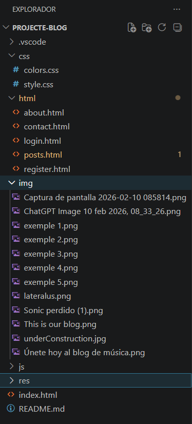

# 🪉 Projecte-blog-música

> *Un petit blog on es parla de música. *

Aquest projecte, tracta sobre crear un blog de la teva decisió i sobre el temari que tu vulguis.

* En petit blog de música comparteixo els meus gustos músicals, i dono certes recomenacions que crec que podrien interesar a més d'una persona.

## 💻 Demo del codi

> *Aqií van unes petites demostracions de com està sent realitzat la codificació d'aquest blog. *

Aqui hi han una serie d'exemples del codi que estic desenvolupant.

## 💽 Tecnologies utilitzades

Aquest codi ha estat escrit en la seva totalitat en html en Visual Studio Code. Utilitzant també css per organitzar millor la pagina i la distribució d'aquesta. També he utilitzat GitHub per assegurar-me que el projecte es guardava correctament.

A l'hora de crear aquest blog tmabé m'he basat en altres blogs de música. Alguns exemples són els següents:

- [LacupulaMúsica](https://www.lacupulamusic.com/blog/)
- [NebraskaMúsic](https://nebraskamusic.es/home-movil/)
- [MCarmenfer](https://mcarmenfer.wordpress.com/)

> *He utilitzat alguna eina més, peró les més importants i destacables són aquestes. *

## 💾 Instal·lació i ús

Per instal·lar aquesta pagina només s'ha descarregar-se el codi d'aquesta (utilitzant una carpeta), obrir VisualStudioCode per obrir-la, i posteriorment, Premir el botó "GoLive" per veure-la.

## 🔩 Estructura del projecte

Aquest projecte etsà ordenat y distribuït amb les següents carpetes:

## ✍️ Autor

Hola sóc en Jofre Miralda, i aquest blog musical ha estat creat per mi, per compartir als meus gustos amb altre gent.

## 🧱 Llicencia del repositori

> *La llicencia que hi ha en el repositori és la Apache 2.0 *

## 🛠 Roadmap o millores futures

El més segur és que el codi sigui modificat en un proper futur perque een comptes de que tingui "tanta codificació", estigui més compactat (utilitzant grid per organitzar-ho tot millor i reduïr la codificació)

>Esperò que us hagueu informat sobre aquest projecte, i sobre el elements que el componen!

.png)